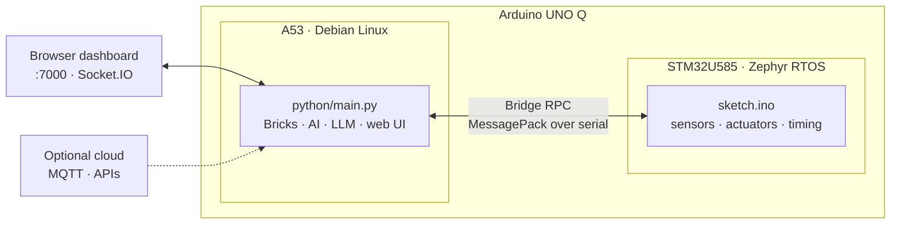

<div align="center">

# uno-q-skill

### Turn Claude into an Arduino UNO Q engineer.

Describe what you want to build; Claude scaffolds the app, picks the right
Bricks, wires the Python ↔ MCU Bridge, builds the web dashboard, and deploys to
the board — across **both brains** of the UNO Q at once: Qualcomm Linux and the
STM32 microcontroller.


[Quick start](#quick-start) · [What it does](#what-it-does) · [Architecture](#architecture) · [Workflow](#the-build-workflow) · [FAQ](#faq)

</div>

---

## Why this exists

The Arduino UNO Q isn't a classic Arduino. It's **two computers on one board** —
a Qualcomm A53 running Debian Linux and an STM32U585 running Zephyr RTOS — talking
over an RPC bridge. Building for it means juggling Python *and* C++, a Bricks
component system, inter-processor messaging that deadlocks if you wire it wrong,
on-device AI under a hard RAM ceiling, and a deploy loop with its own foot-guns.

This skill hands Claude all of that knowledge — board architecture, the full
Bricks catalog, the Bridge RPC contract, the deadlock anti-patterns, deploy
safety, and ready-to-fill templates — so it builds **correct, on-device,
production-grade** UNO Q apps instead of guessing.

---

## Quick start

```bash
git clone https://github.com/maybethereisone-C/uno-q-skill ~/.claude/skills/arduino-uno-q
```

Claude Code auto-discovers the skill. Then just ask:

> *"On my Arduino UNO Q, read the Modulino accelerometer on the MCU, stream it to
> Python, and show a live chart in a web dashboard."*

Claude scaffolds the app, selects Bricks, writes both the Python and the sketch
side, wires the Bridge, builds the UI, and walks you through deploying it.

---

## What it does

| | |
|---|---|
| 🧠 **Dual-brain builds** | Splits the job correctly — timing-critical code on the STM32U585 MCU, heavy logic and AI on the A53 Linux side — and wires them together. |
| 🧱 **29 official Bricks** | Composes pre-built components for AI vision, ASR/TTS, on-device LLM, SQL & time-series databases, MQTT/Telegram/Arduino Cloud, web UI, and peripherals. |
| 🔌 **Bridge RPC, done right** | Generates the Python ↔ MCU messaging (MessagePack-RPC over serial) and enforces the anti-patterns that otherwise deadlock the board. |
| 🤖 **On-device AI & LLM** | Runs vision, audio, and a quantized local LLM directly on the board — no cloud required — within the real RAM budget. |
| 📊 **Web dashboards** | Builds a Socket.IO dashboard served from the board on port 7000, with browser ↔ Python ↔ MCU message wiring. |
| 🚀 **Safe deploy loop** | Push → fix ownership → restart → stream logs, with the `chown arduino:arduino` step and other foot-guns handled. |

---

## Architecture



**Mental model:** the MCU does what must happen *now* (read sensors, drive
hardware, hit tight timing); Linux does what needs *power* (AI, databases, the UI,
the internet); the Bridge is the only road between them — and it's
request/response with a 10-second timeout, so it must never be blocked or nested.

---

## The build workflow

A repeatable 6-step path (each step is a guide in `workflow/`):

1. **Scaffold** — create the app folder (`app.yaml`, `python/main.py`, `sketch/`, `assets/`) from templates.
2. **Select Bricks** — map each capability to a Brick and declare it in `app.yaml`.
3. **Python logic** — instantiate Bricks, register UI handlers, wire the Bridge, end with `App.run()`.
4. **MCU sketch** — `Bridge.begin()`, expose methods with `provide`, push telemetry with `notify`, never block `loop()`.
5. **Web UI** — `index.html` + `app.js` + `style.css`, Socket.IO event names matched to the Python handlers (assets vendored, no CDN).
6. **Deploy & test** — push to the board, fix ownership, restart, stream logs, verify end-to-end.

---

## The rules it enforces

Every build is held to five rule sets in `rules/`. The ones that matter most:

- **Bridge anti-patterns** — never nest `Bridge.call()` inside a `provide` callback, never block in `loop()` or a callback, always check the `ok` flag from `.result()`, and `App.run()` must be the last line. These prevent the silent deadlocks that hang the board.
- **Deploy safety** — `chown -R arduino:arduino` after every push (adb runs as root, the app runs as `arduino`); let `app start` compile/flash the MCU, never `arduino-cli upload` directly.
- **Resource limits** — one AI model loaded at a time; respect the RAM ceiling; compress images before sending them over the Bridge.
- **Quality standards** — small functions, validated Bridge inputs, no inlined secrets, proper logging.
- **Best practices** — right brain for the job, compose official Bricks before writing custom, on-device first.

---

## What's inside

```
uno-q-skill/
├── SKILL.md                      # Router — start here; loads references on demand
├── references/                   # 11 deep-dive guides
│   ├── board-architecture.md     # The dual-brain model: A53 Linux + STM32U585 MCU
│   ├── app-anatomy.md            # App folder structure & how the pieces connect
│   ├── arduino-app-cli.md        # Full arduino-app-cli + REST API reference
│   ├── arduino-cli-zephyr.md     # Classic arduino-cli for isolated MCU builds
│   ├── bridge-rpc.md             # Bridge RPC deep dive (Python & C++ APIs, examples)
│   ├── bricks-catalog.md         # All 29 official Bricks by category
│   ├── on-device-llm.md          # The arduino:llm Brick — local LLM, streaming, memory
│   ├── ollama-on-board.md        # Ollama runtime + running Claude Code on the board
│   ├── web-ui-brick.md           # arduino:web_ui — Socket.IO dashboards
│   ├── custom-bricks.md          # Authoring your own Bricks
│   └── troubleshooting.md        # Setup, connect, run, AI/model, storage triage
├── rules/                        # 5 rule sets (bridge anti-patterns, deploy safety, …)
├── workflow/                     # The 6-step build path (step1 … step6)
├── examples/                     # 2 worked builds (sensor dashboard, AI camera)
├── templates/                    # app.yaml, main.py, sketch.ino, sketch.yaml, web assets
└── scripts/                      # new-app · deploy · logs · board-connect
```

### Bundled scripts

| Script | What it does |
|---|---|
| `scripts/new-app.sh <name>` | Scaffold a new app on the board via `arduino-app-cli app new`. |
| `scripts/deploy.sh [app] [dir]` | Push a local app to the board, fix ownership, restart it. |
| `scripts/logs.sh <app> --follow` | Stream the app's Python logs from the board. |
| `scripts/board-connect.sh [name]` | List connected boards over adb; optionally SSH in. |

---

## Worked examples

- **Sensor → dashboard** (`examples/general-sensor-dashboard.md`) — MCU reads an accelerometer, streams samples over the Bridge, Python pushes them to a live browser chart. Proves **MCU → Linux → browser**.
- **AI camera** (`examples/general-ai-camera.md`) — camera frames run through an on-device object-detection Brick; annotated results stream to the dashboard. Proves **on-device AI + video streaming**.

---

## Requirements

- **Claude Code** (the skill auto-loads from `~/.claude/skills/`).
- An **Arduino UNO Q** board with a recent OS and `arduino-app-cli` installed.
- **`adb`** on your dev machine for deploying and streaming logs.
- Optional: `arduino-cli` for isolated MCU-only builds.

---

## FAQ

**Is this firmware or a code dump?**
Neither. It's the knowledge and tooling that let Claude *build* UNO Q apps — both
the Python (Linux) and C++ (MCU) sides — to production standards.

**Does it work without the cloud?**
Yes. Vision, audio, and a local LLM all run on-device. Cloud Bricks exist, but
the skill defaults to on-device first.

**Why is building for this board hard without it?**
Two processors, two languages, an RPC bridge that deadlocks if misused, a hard
RAM budget, and a deploy loop with ownership foot-guns. The skill encodes all of
it so you don't learn it the painful way.

**Do I need to know C++ and Python both?**
No — that's the point. You describe the behavior; Claude writes both sides and
keeps the Bridge contract consistent between them.

---

## Update

```bash
cd ~/.claude/skills/arduino-uno-q
git pull
```

---

## Contributing

Issues and PRs welcome — new Brick coverage, additional worked examples, and
reference fixes especially. Keep templates secret-free (placeholders only).

---

<div align="center">

If this helps you build on the UNO Q, **star the repo** — it helps other makers find it.

</div>
